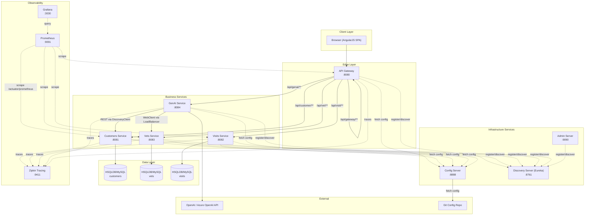

# 00 - Project Overview and Technology Mapping

## What is Spring Petclinic Microservices?

Spring Petclinic Microservices is a reference application demonstrating microservice architecture patterns using the Spring ecosystem. It models a **veterinary clinic management system** where pet owners can register, add their pets, and schedule visits with veterinarians. The application also features an AI-powered chatbot that can query and modify clinic data via natural language.

The system is decomposed into 8 independently deployable services coordinated through service discovery and centralized configuration.

**Source version:** Spring Boot 4.0.1, Spring Cloud 2025.1.0 (Oakwood), Java 17

## Architecture Diagram

## Technology Mapping: Java/Spring to Python

| Java/Spring Component | Version in Source | Python Equivalent | Python Package |
|---|---|---|---|
| Spring Boot 4.0.1 | 4.0.1 | FastAPI | `fastapi`, `uvicorn` |
| Spring WebMVC | (via Boot) | FastAPI routers | `fastapi` |
| Spring WebFlux (Gateway, GenAI) | (via Boot) | HTTPX async client | `httpx` |
| Spring Data JPA / Hibernate | (via Boot) | SQLAlchemy ORM | `sqlalchemy`, `alembic` |
| HSQLDB (dev) / MySQL (prod) | HSQLDB 2.x / MySQL 8.x | SQLite (dev) / PostgreSQL (prod) | `aiosqlite`, `asyncpg` |
| Spring Cloud Config Server | 2025.1.0 | File-based / python-dotenv | `python-dotenv`, `pyyaml` |
| Netflix Eureka (Discovery) | 2025.1.0 | Consul / custom registry | `python-consul2` or custom |
| Spring Cloud Gateway | 2025.1.0 | Reverse proxy / NGINX / FastAPI | `fastapi`, `httpx` |
| Resilience4j (Circuit Breaker) | (via Spring Cloud) | tenacity / pybreaker | `tenacity`, `pybreaker` |
| Spring AI 2.0.0-M1 | 2.0.0-M1 | OpenAI Python SDK / LangChain | `openai`, `langchain` |
| Micrometer + Prometheus | (via Boot) | prometheus_client | `prometheus-client` |
| Micrometer Tracing + Zipkin | (via Boot) | OpenTelemetry | `opentelemetry-sdk`, `opentelemetry-exporter-zipkin` |
| Caffeine Cache | (via Boot) | cachetools / Redis | `cachetools` |
| Spring Boot Admin | (via Boot) | Custom health dashboard | `fastapi` + custom |
| Jakarta Validation | (via Boot) | Pydantic validators | `pydantic` |
| Jackson JSON | (via Boot) | Pydantic + built-in JSON | `pydantic` |
| Chaos Monkey | 3.1.0 | chaos-toolkit (optional) | `chaostoolkit` |
| JUnit 5 | (via Boot) | pytest | `pytest`, `pytest-asyncio` |
| Maven | 3.x | pip / Poetry | `poetry` |
| Docker / Podman | - | Docker / Podman | Same |

## Service Inventory

| # | Service Name | Port | Purpose | Web Framework | Database | Key Dependencies |
|---|---|---|---|---|---|---|
| 1 | **config-server** | 8888 | Centralized configuration (git-backed) | FastAPI | None | `pyyaml`, `gitpython` |
| 2 | **discovery-server** | 8761 | Service registry (Eureka) | FastAPI | In-memory | `python-consul2` or custom |
| 3 | **api-gateway** | 8080 | API routing, circuit breaker, static UI | FastAPI | None | `httpx`, `tenacity` |
| 4 | **customers-service** | 8081 | Owner and pet management (CRUD) | FastAPI | SQLite/PostgreSQL | `sqlalchemy`, `pydantic` |
| 5 | **visits-service** | 8082 | Visit scheduling and history | FastAPI | SQLite/PostgreSQL | `sqlalchemy`, `pydantic` |
| 6 | **vets-service** | 8083 | Veterinarian directory with caching | FastAPI | SQLite/PostgreSQL | `sqlalchemy`, `cachetools` |
| 7 | **genai-service** | 8084 | AI chatbot with tool calling (RAG) | FastAPI | None (vector store) | `openai`, `numpy` |
| 8 | **admin-server** | 9090 | Service health monitoring dashboard | FastAPI | None | `httpx` |

## Supporting Infrastructure (not rebuilt, used as-is)

| Component | Port | Purpose |
|---|---|---|
| Zipkin | 9411 | Distributed tracing |
| Prometheus | 9091 | Metrics collection |
| Grafana | 3030 | Metrics dashboards |

## Specification Index

| Spec File | Title | Contents |
|---|---|---|
| [00-overview.md](./00-overview.md) | Project Overview | This file - architecture, tech mapping, service inventory |
| [01-architecture.md](./01-architecture.md) | Architecture Patterns | Service discovery, config, gateway, circuit breakers, startup chain |
| [02-data-models.md](./02-data-models.md) | Data Models & Schemas | Entities, ER diagram, SQLAlchemy models, Pydantic schemas, seed data |
| [03-api-spec.md](./03-api-spec.md) | REST API Specification | All endpoints, request/response formats, status codes |
| [04-infrastructure.md](./04-infrastructure.md) | Infrastructure & DevOps | Docker, monitoring, tracing, deployment configuration |
| [05-inter-service-communication.md](./05-inter-service-communication.md) | Inter-Service Communication | Service-to-service calls, load balancing, resilience patterns |
| [06-genai-service.md](./06-genai-service.md) | GenAI Service | LLM integration, tool calling, vector store, RAG patterns |
| [07-frontend.md](./07-frontend.md) | Frontend Specification | AngularJS SPA structure, routes, API integration |
| [08-testing.md](./08-testing.md) | Testing Specification | Test strategy, fixtures, integration tests for Python rewrite |

## Startup Dependency Order

The services must start in this order (enforced via Docker Compose health checks):

1. **config-server** (no dependencies) - must be healthy before anything else starts
2. **discovery-server** (depends on: config-server healthy)
3. **All business services + api-gateway + admin-server** (depend on: config-server healthy AND discovery-server healthy)
4. **tracing-server (Zipkin)** (no dependencies, can start anytime)
5. **Grafana + Prometheus** (no dependencies, can start anytime)

## Key Architectural Decisions for Python Rewrite

1. **Each service is a separate FastAPI application** with its own `main.py`, database, and Docker image.
2. **Replace Eureka with a simpler approach**: either Consul, a lightweight custom service registry, or hardcoded service URLs in configuration (for simplicity).
3. **Replace Spring Cloud Config** with file-based YAML/env configuration loaded via `python-dotenv` and `pyyaml`.
4. **Replace Spring Cloud Gateway** with a FastAPI reverse proxy using `httpx` for async proxying, or NGINX for production.
5. **Use SQLAlchemy 2.0 async** with SQLite for development and PostgreSQL for production, matching the HSQLDB/MySQL pattern.
6. **Use Pydantic v2** for all request/response validation, replacing Jakarta Validation annotations.
7. **Use the OpenAI Python SDK directly** instead of Spring AI for the GenAI service.
8. **Preserve all port numbers** from the original to maintain compatibility with the frontend and documentation.
