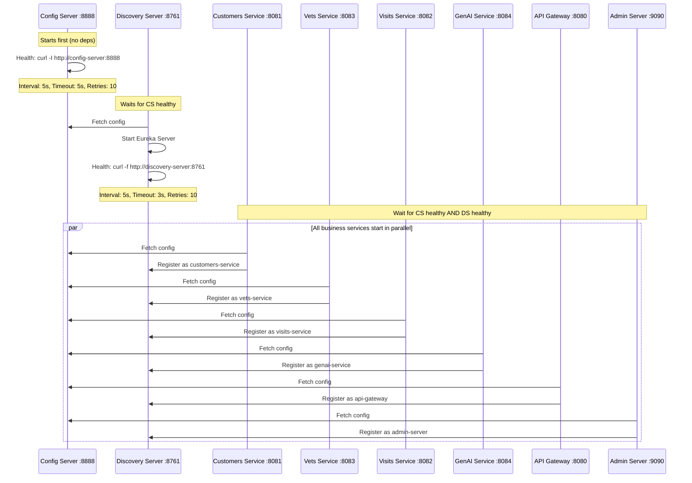
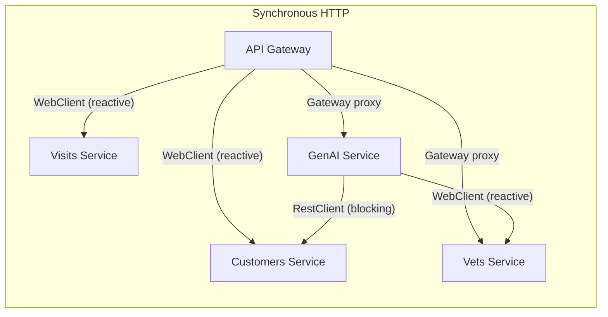

# 01 - Microservices Architecture Patterns

## 1. Service Discovery

### Java Implementation: Netflix Eureka

The Discovery Server (`spring-petclinic-discovery-server`) runs a **Eureka Server** on port **8761**.

**Source:** `DiscoveryServerApplication.java` uses `@EnableEurekaServer` annotation.

**How it works:**
- Each business service includes `spring-cloud-starter-netflix-eureka-client` as a dependency
- Services register themselves on startup using their `spring.application.name` (e.g., `customers-service`, `vets-service`)
- The API Gateway and GenAI service use `@EnableDiscoveryClient` to look up services by name
- Service-to-service calls use logical names (e.g., `http://customers-service/owners`) which are resolved via Eureka

**Configuration flow:**
1. Discovery Server starts and waits for Config Server to be healthy
2. Discovery Server fetches its own config from Config Server at `http://config-server:8888`
3. Business services register with Discovery Server after they start
4. Clients (Gateway, GenAI) resolve service names through Eureka

### Python Equivalent

**Option A: Consul (recommended for production)**
```python
# Service registration at startup
import consul

c = consul.Consul(host="consul-server", port=8500)
c.agent.service.register(
    name="customers-service",
    address="customers-service",
    port=8081,
    check=consul.Check.http("http://customers-service:8081/health", interval="10s")
)
```

**Option B: Simple custom registry (recommended for this project)**

A lightweight FastAPI service that maintains an in-memory registry:

```python
# discovery-server/main.py
from fastapi import FastAPI
from typing import dict

app = FastAPI()
registry: dict[str, list[dict]] = {}

@app.post("/register")
async def register(service_name: str, host: str, port: int):
    if service_name not in registry:
        registry[service_name] = []
    registry[service_name].append({"host": host, "port": port})
    return {"status": "registered"}

@app.get("/services/{service_name}")
async def get_instances(service_name: str):
    return registry.get(service_name, [])
```

**Option C: Hardcoded URLs via environment variables (simplest)**
```python
# config.py
import os
CUSTOMERS_SERVICE_URL = os.getenv("CUSTOMERS_SERVICE_URL", "http://localhost:8081")
VETS_SERVICE_URL = os.getenv("VETS_SERVICE_URL", "http://localhost:8083")
VISITS_SERVICE_URL = os.getenv("VISITS_SERVICE_URL", "http://localhost:8082")
```

## 2. Centralized Configuration

### Java Implementation: Spring Cloud Config Server

The Config Server (`spring-petclinic-config-server`) runs on port **8888**.

**Source:** `ConfigServerApplication.java` uses `@EnableConfigServer` annotation.

**Configuration source** (`application.yml`):
```yaml
server.port: 8888
spring:
  cloud:
    config:
      server:
        git:
          uri: https://github.com/spring-petclinic/spring-petclinic-microservices-config
          default-label: main
        native:
          searchLocations: file:///${GIT_REPO}
```

The Config Server serves configuration from a **Git repository**. Each service fetches its config at startup:

```yaml
# Example: customers-service application.yml
spring:
  application:
    name: customers-service
  config:
    import: optional:configserver:${CONFIG_SERVER_URL:http://localhost:8888/}
```

The `optional:` prefix means the service can start even if Config Server is unavailable (for local development). In Docker, the import is mandatory:
```yaml
spring:
  config:
    activate:
      on-profile: docker
    import: configserver:http://config-server:8888
```

**Git config repo** contains per-service YAML files (e.g., `customers-service.yml`, `vets-service.yml`) with settings for:
- Server ports
- Database configuration
- Eureka client settings
- Actuator endpoints
- Tracing/Zipkin settings

### Python Equivalent

Replace with file-based configuration using `pyyaml` and `python-dotenv`:

```python
# shared/config.py
import os
import yaml
from pathlib import Path

def load_config(service_name: str) -> dict:
    """Load config from YAML files, with env var overrides."""
    config_dir = Path(os.getenv("CONFIG_DIR", "./config"))

    # Load application-level defaults
    base_config = {}
    base_file = config_dir / "application.yml"
    if base_file.exists():
        with open(base_file) as f:
            base_config = yaml.safe_load(f)

    # Load service-specific config
    service_file = config_dir / f"{service_name}.yml"
    if service_file.exists():
        with open(service_file) as f:
            service_config = yaml.safe_load(f)
            base_config.update(service_config)

    return base_config
```

Store all config files in a `config/` directory in the project root, mirroring the Git config repo structure.

## 3. API Gateway

### Java Implementation: Spring Cloud Gateway (WebFlux)

The API Gateway (`spring-petclinic-api-gateway`) runs on port **8080** and uses **Spring Cloud Gateway Server WebFlux**.

**Source:** `application.yml` defines route configuration:

```yaml
spring:
  cloud:
    gateway:
      server:
        webflux:
          default-filters:
            - name: CircuitBreaker
              args:
                name: defaultCircuitBreaker
                fallbackUri: forward:/fallback
            - name: Retry
              args:
                retries: 1
                statuses: SERVICE_UNAVAILABLE
                methods: POST
          routes:
            - id: vets-service
              uri: lb://vets-service
              predicates:
                - Path=/api/vet/**
              filters:
                - StripPrefix=2
            - id: visits-service
              uri: lb://visits-service
              predicates:
                - Path=/api/visit/**
              filters:
                - StripPrefix=2
            - id: customers-service
              uri: lb://customers-service
              predicates:
                - Path=/api/customer/**
              filters:
                - StripPrefix=2
            - id: genai-service
              uri: lb://genai-service
              predicates:
                - Path=/api/genai/**
              filters:
                - StripPrefix=2
                - CircuitBreaker=name=genaiCircuitBreaker,fallbackUri=/fallback
```

**Key behaviors:**
- `lb://` prefix means load-balanced via Eureka service discovery
- `StripPrefix=2` removes the first 2 path segments (e.g., `/api/customer/owners` becomes `/owners`)
- Default filters apply a `CircuitBreaker` and `Retry` (1 retry on SERVICE_UNAVAILABLE for POST) to all routes
- The GenAI route has an additional dedicated circuit breaker
- Fallback endpoint returns HTTP 503 with message "Chat is currently unavailable. Please try again later."

**Additional gateway features:**
- Serves the static AngularJS SPA from `classpath:/static/`
- Has a custom `ApiGatewayController` at `/api/gateway/owners/{ownerId}` that aggregates owner data with their pet visits (BFF pattern)
- Uses `@LoadBalanced WebClient` for reactive service-to-service calls

### Route Table

| Gateway Path | Target Service | Backend Path | Strip Prefix | Extra Filters |
|---|---|---|---|---|
| `/api/customer/**` | `customers-service` | `/**` | 2 | Default CB + Retry |
| `/api/vet/**` | `vets-service` | `/**` | 2 | Default CB + Retry |
| `/api/visit/**` | `visits-service` | `/**` | 2 | Default CB + Retry |
| `/api/genai/**` | `genai-service` | `/**` | 2 | Default CB + Retry + genaiCircuitBreaker |
| `/api/gateway/**` | (local controller) | - | - | Programmatic CB |
| `/**` | Static files | `classpath:/static/` | - | None |

### Python Equivalent

```python
# api-gateway/main.py
from fastapi import FastAPI, Request, Response
from fastapi.staticfiles import StaticFiles
import httpx
from tenacity import retry, stop_after_attempt, retry_if_exception_type

app = FastAPI()

SERVICE_URLS = {
    "customer": "http://localhost:8081",
    "vet": "http://localhost:8083",
    "visit": "http://localhost:8082",
    "genai": "http://localhost:8084",
}

@app.api_route("/api/{service}/{path:path}", methods=["GET", "POST", "PUT", "DELETE"])
async def proxy(service: str, path: str, request: Request):
    base_url = SERVICE_URLS.get(service)
    if not base_url:
        return Response(status_code=404, content="Service not found")

    async with httpx.AsyncClient(timeout=10.0) as client:
        url = f"{base_url}/{path}"
        response = await client.request(
            method=request.method,
            url=url,
            headers={k: v for k, v in request.headers.items() if k != "host"},
            content=await request.body(),
            params=request.query_params,
        )
        return Response(
            content=response.content,
            status_code=response.status_code,
            headers=dict(response.headers),
        )

# Serve static AngularJS SPA
app.mount("/", StaticFiles(directory="static", html=True), name="static")
```

## 4. Circuit Breaker Pattern

### Java Implementation: Resilience4j

**Source:** `ApiGatewayApplication.java` configures the circuit breaker factory:

```java
@Bean
public Customizer<ReactiveResilience4JCircuitBreakerFactory> defaultCustomizer() {
    return factory -> factory.configureDefault(id -> new Resilience4JConfigBuilder(id)
        .circuitBreakerConfig(CircuitBreakerConfig.ofDefaults())
        .timeLimiterConfig(TimeLimiterConfig.custom()
            .timeoutDuration(Duration.ofSeconds(10))
            .build())
        .build());
}
```

**Resilience4j defaults used** (`CircuitBreakerConfig.ofDefaults()`):
- Failure rate threshold: 50%
- Slow call rate threshold: 100%
- Slow call duration threshold: 60 seconds
- Sliding window type: COUNT_BASED
- Sliding window size: 100
- Minimum number of calls: 100
- Wait duration in open state: 60 seconds
- Permitted calls in half-open: 10
- Automatic transition from open to half-open: disabled

**Custom time limiter:** 10 second timeout for all service calls.

**Circuit breakers in use:**
1. `defaultCircuitBreaker` - applied as a default gateway filter to all routes
2. `genaiCircuitBreaker` - additional breaker specifically for GenAI route
3. `getOwnerDetails` - programmatic breaker in `ApiGatewayController` for the owner-details aggregation endpoint

**Fallback behavior:**
- Gateway filter fallback: forwards to `/fallback` endpoint which returns HTTP 503
- `ApiGatewayController` fallback: returns empty visits list on failure (graceful degradation)

### Python Equivalent

```python
# Using tenacity for retries and pybreaker for circuit breaking
import pybreaker
from tenacity import retry, stop_after_attempt, wait_exponential

# Circuit breaker with Resilience4j-like defaults
default_breaker = pybreaker.CircuitBreaker(
    fail_max=50,          # Opens after 50 failures (50% of 100)
    reset_timeout=60,     # Wait 60s before half-open
    name="defaultCircuitBreaker",
)

genai_breaker = pybreaker.CircuitBreaker(
    fail_max=5,
    reset_timeout=60,
    name="genaiCircuitBreaker",
)

@retry(stop=stop_after_attempt(2), retry=retry_if_exception_type(httpx.HTTPStatusError))
@default_breaker
async def call_service(client: httpx.AsyncClient, url: str, **kwargs):
    response = await client.request(**kwargs, url=url, timeout=10.0)
    response.raise_for_status()
    return response
```

## 5. Startup Dependency Chain

### Docker Compose Health Checks



### Python Equivalent Startup Order

In the Python rewrite, replicate this with Docker Compose `depends_on` + `healthcheck`:

```yaml
services:
  config-server:
    healthcheck:
      test: ["CMD", "curl", "-f", "http://localhost:8888/health"]
      interval: 5s
      timeout: 5s
      retries: 10

  discovery-server:
    depends_on:
      config-server:
        condition: service_healthy
    healthcheck:
      test: ["CMD", "curl", "-f", "http://localhost:8761/health"]
      interval: 5s
      timeout: 3s
      retries: 10

  customers-service:
    depends_on:
      config-server:
        condition: service_healthy
      discovery-server:
        condition: service_healthy
```

## 6. Load Balancing

### Java Implementation

Two patterns are used:

**1. Client-side load balancing via `@LoadBalanced` WebClient (API Gateway):**
```java
@Bean
@LoadBalanced
public WebClient.Builder loadBalancedWebClientBuilder() {
    return WebClient.builder();
}
```
This is used in `CustomersServiceClient` and `VisitsServiceClient` to call backend services via Eureka names:
```java
// CustomersServiceClient.java
webClientBuilder.build().get()
    .uri("http://customers-service/owners/{ownerId}", ownerId)
    .retrieve()
    .bodyToMono(OwnerDetails.class);
```

**2. Gateway `lb://` scheme:** Routes use `lb://vets-service` which integrates with Spring Cloud LoadBalancer for client-side load balancing across multiple instances.

**3. GenAI Service uses `DiscoveryClient` directly:**
```java
// AIDataProvider.java
private URI getCustomerServiceUri() {
    return discoveryClient.getInstances("customers-service").get(0).getUri();
}
```

### Python Equivalent

With hardcoded URLs (simplest): no load balancing needed for single instances. For multiple instances, use round-robin:

```python
import itertools

class ServiceRegistry:
    def __init__(self):
        self._instances: dict[str, list[str]] = {}
        self._iterators: dict[str, itertools.cycle] = {}

    def register(self, name: str, urls: list[str]):
        self._instances[name] = urls
        self._iterators[name] = itertools.cycle(urls)

    def get_url(self, name: str) -> str:
        return next(self._iterators[name])
```

## 7. Service Communication Patterns Summary



| Caller | Target | Client Type | Discovery Method |
|---|---|---|---|
| API Gateway (proxy routes) | All services | Gateway `lb://` | Eureka |
| API Gateway (`ApiGatewayController`) | Customers, Visits | `@LoadBalanced WebClient` | Eureka |
| GenAI Service (`AIDataProvider`) | Customers Service | `RestClient` | `DiscoveryClient.getInstances()` |
| GenAI Service (`VectorStoreController`) | Vets Service | `@LoadBalanced WebClient` | Eureka (via load-balanced WebClient) |

## 8. Configuration per Service

Each service has a local `application.yml` that sets:
1. `spring.application.name` - the service identity
2. `spring.config.import` - Config Server URL (optional for local, mandatory for Docker)
3. Profile-specific overrides for Docker deployment

The centralized config (from the Git repo) typically provides:
- Server port
- Database connection (HSQLDB in-memory by default, MySQL for production profile)
- Eureka client settings (service URL, register/fetch intervals)
- Actuator endpoint exposure
- Zipkin/tracing endpoint
- Logging levels

### Vets Service - Caching Configuration

The vets service has caching enabled:
```yaml
spring:
  cache:
    cache-names: vets
  profiles:
    active: production
```
This uses **Caffeine** as the cache implementation (included as a dependency). The `vets` cache name caches the vet list to avoid repeated database queries.

### GenAI Service - Special Configuration

```yaml
spring:
  main:
    web-application-type: reactive
  ai:
    chat:
      client:
        enabled: true
    openai:
      api-key: ${OPENAI_API_KEY:demo}
      chat:
        options:
          temperature: 0.7
          model: gpt-4o-mini
    azure:
      openai:
        api-key: ${AZURE_OPENAI_KEY}
        endpoint: ${AZURE_OPENAI_ENDPOINT}
        chat:
          options:
            temperature: 0.7
            deployment-name: gpt-4o
```

The GenAI service supports both OpenAI and Azure OpenAI backends (swappable via Maven dependency). It uses Spring AI 2.0.0-M1.
