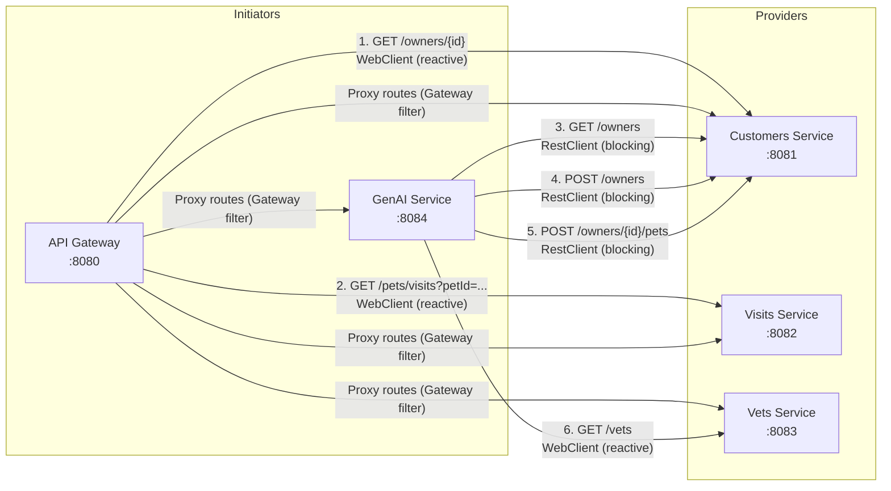
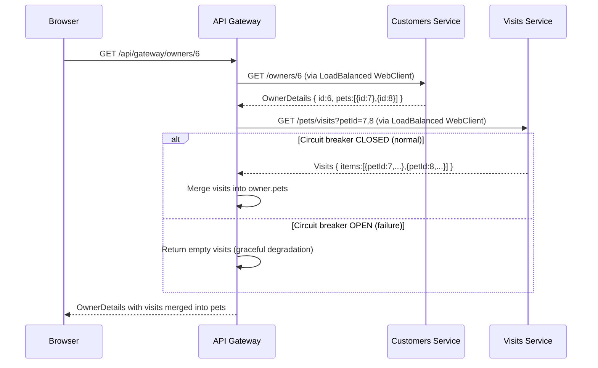

# 05 - Inter-Service Communication

## Overview

The Spring Petclinic microservices use **synchronous HTTP** for all inter-service communication. There is no asynchronous messaging (no message queues, no event-driven patterns). Three services initiate cross-service calls:

1. **API Gateway** -- aggregates owner + visit data (BFF pattern)
2. **GenAI Service** -- calls customers-service and vets-service for AI tool functions
3. **Visits Service** -- provides a batch endpoint consumed by the API Gateway

## Communication Map



## 1. API Gateway - BFF Pattern (Owner Details Aggregation)

### Source: `ApiGatewayController.java`

The API Gateway implements a **Backend-for-Frontend (BFF)** endpoint that aggregates data from two services into a single response.

**Endpoint:** `GET /api/gateway/owners/{ownerId}`

**Flow:**



**Source code detail:**

```java
// ApiGatewayController.java
@GetMapping(value = "owners/{ownerId}")
public Mono<OwnerDetails> getOwnerDetails(final @PathVariable int ownerId) {
    return customersServiceClient.getOwner(ownerId)
        .flatMap(owner ->
            visitsServiceClient.getVisitsForPets(owner.getPetIds())
                .transform(it -> {
                    ReactiveCircuitBreaker cb = cbFactory.create("getOwnerDetails");
                    return cb.run(it, throwable -> emptyVisitsForPets());
                })
                .map(addVisitsToOwner(owner))
        );
}
```

**Key behaviors:**
- Uses reactive `Mono` (non-blocking)
- Calls are sequential: first fetch owner, then fetch visits for that owner's pets
- Circuit breaker `getOwnerDetails` wraps the visits call
- On failure: returns owner with empty visits (not an error)
- Pet IDs are extracted from the owner response and sent as comma-separated query parameter

### CustomersServiceClient

```java
// CustomersServiceClient.java
public Mono<OwnerDetails> getOwner(final int ownerId) {
    return webClientBuilder.build().get()
        .uri("http://customers-service/owners/{ownerId}", ownerId)
        .retrieve()
        .bodyToMono(OwnerDetails.class);
}
```

- Uses `@LoadBalanced WebClient.Builder` (service name resolved via Eureka)
- Reactive (non-blocking) call
- No retry or circuit breaker on this specific call

### VisitsServiceClient

```java
// VisitsServiceClient.java
public Mono<Visits> getVisitsForPets(final List<Integer> petIds) {
    return webClientBuilder.build()
        .get()
        .uri(hostname + "pets/visits?petId={petId}", joinIds(petIds))
        .retrieve()
        .bodyToMono(Visits.class);
}

private String joinIds(List<Integer> petIds) {
    return petIds.stream().map(Object::toString).collect(joining(","));
}
```

- Uses `@LoadBalanced WebClient.Builder`
- Default hostname: `http://visits-service/`
- Pet IDs joined with commas: `?petId=7,8`
- Wrapped by circuit breaker in the controller

### Python Equivalent

```python
# api_gateway/bff.py
import httpx
from fastapi import APIRouter
from tenacity import retry, stop_after_attempt
import pybreaker

router = APIRouter(prefix="/api/gateway")
visits_breaker = pybreaker.CircuitBreaker(fail_max=5, reset_timeout=60, name="getOwnerDetails")

CUSTOMERS_URL = "http://localhost:8081"
VISITS_URL = "http://localhost:8082"

@router.get("/owners/{owner_id}")
async def get_owner_details(owner_id: int):
    async with httpx.AsyncClient(timeout=10.0) as client:
        # Step 1: Fetch owner with pets
        owner_resp = await client.get(f"{CUSTOMERS_URL}/owners/{owner_id}")
        owner_resp.raise_for_status()
        owner = owner_resp.json()

        # Step 2: Fetch visits (with circuit breaker)
        pet_ids = [p["id"] for p in owner.get("pets", [])]
        visits = await _fetch_visits(client, pet_ids)

        # Step 3: Merge visits into pets
        for pet in owner.get("pets", []):
            pet["visits"] = [v for v in visits if v["petId"] == pet["id"]]

        return owner

async def _fetch_visits(client: httpx.AsyncClient, pet_ids: list[int]) -> list[dict]:
    if not pet_ids:
        return []
    try:
        pet_id_str = ",".join(str(pid) for pid in pet_ids)
        resp = await client.get(f"{VISITS_URL}/pets/visits", params={"petId": pet_id_str})
        resp.raise_for_status()
        return resp.json().get("items", [])
    except Exception:
        # Graceful degradation: return empty visits on failure
        return []
```

## 2. API Gateway - Proxy Routes (Gateway Filter)

### How It Works

The Spring Cloud Gateway proxies requests to backend services via route configuration (documented in `01-architecture.md`). The proxy is transparent -- it forwards the request and returns the response unchanged.

**Route transformations:**

| Client Request | Backend Request | Service |
|---|---|---|
| `GET /api/customer/owners` | `GET /owners` | customers-service:8081 |
| `GET /api/customer/owners/1` | `GET /owners/1` | customers-service:8081 |
| `POST /api/customer/owners` | `POST /owners` | customers-service:8081 |
| `PUT /api/customer/owners/1` | `PUT /owners/1` | customers-service:8081 |
| `GET /api/customer/petTypes` | `GET /petTypes` | customers-service:8081 |
| `POST /api/customer/owners/1/pets` | `POST /owners/1/pets` | customers-service:8081 |
| `GET /api/vet/vets` | `GET /vets` | vets-service:8083 |
| `POST /api/visit/owners/*/pets/7/visits` | `POST /owners/*/pets/7/visits` | visits-service:8082 |
| `GET /api/visit/pets/visits?petId=7,8` | `GET /pets/visits?petId=7,8` | visits-service:8082 |
| `POST /api/genai/chatclient` | `POST /chatclient` | genai-service:8084 |

**Applied filters (on every proxied request):**
1. `StripPrefix=2` -- removes `/api/{service}` prefix
2. `CircuitBreaker(name=defaultCircuitBreaker, fallbackUri=/fallback)` -- wraps the proxy call
3. `Retry(retries=1, statuses=SERVICE_UNAVAILABLE, methods=POST)` -- retries POST on 503

### Python Equivalent

See the proxy implementation in `01-architecture.md`. The key is a catch-all route handler that strips the prefix and forwards.

## 3. GenAI Service - REST Calls to Customers Service

### Source: `AIDataProvider.java`

The GenAI service calls customers-service using a **blocking `RestClient`** and resolves the service URL through **`DiscoveryClient`**.

```java
// AIDataProvider.java
private final RestClient restClient;
private final DiscoveryClient discoveryClient;

public AIDataProvider(VectorStore vectorStore, DiscoveryClient discoveryClient) {
    this.restClient = RestClient.builder().build();
    this.discoveryClient = discoveryClient;
}

private URI getCustomerServiceUri() {
    return discoveryClient.getInstances("customers-service").get(0).getUri();
}
```

### Call 1: List All Owners

```java
public List<OwnerDetails> getAllOwners() {
    return restClient
        .get()
        .uri(getCustomerServiceUri() + "/owners")
        .retrieve()
        .body(new ParameterizedTypeReference<>() {});
}
```

- **Method:** `GET`
- **URL:** `http://<customers-service-host>:<port>/owners`
- **Response:** `List<OwnerDetails>` (id, firstName, lastName, address, city, telephone, pets)
- **Used by:** `PetclinicTools.listOwners()` LLM tool function

### Call 2: Add Owner

```java
public OwnerDetails addOwnerToPetclinic(OwnerRequest ownerRequest) {
    return restClient
        .post()
        .uri(getCustomerServiceUri() + "/owners")
        .body(ownerRequest)
        .retrieve()
        .body(OwnerDetails.class);
}
```

- **Method:** `POST`
- **URL:** `http://<customers-service-host>:<port>/owners`
- **Request body:** `OwnerRequest` (firstName, lastName, address, city, telephone)
- **Response:** `OwnerDetails`
- **Used by:** `PetclinicTools.addOwnerToPetclinic()` LLM tool function

### Call 3: Add Pet to Owner

```java
public PetDetails addPetToOwner(int ownerId, PetRequest petRequest) {
    return restClient
        .post()
        .uri(getCustomerServiceUri() + "/owners/" + ownerId + "/pets")
        .body(petRequest)
        .retrieve()
        .body(PetDetails.class);
}
```

- **Method:** `POST`
- **URL:** `http://<customers-service-host>:<port>/owners/{ownerId}/pets`
- **Request body:** `PetRequest` (id, birthDate, name, typeId)
- **Response:** `PetDetails`
- **Used by:** `PetclinicTools.addPetToOwner()` LLM tool function

## 4. GenAI Service - Vet Data Loading (Vector Store)

### Source: `VectorStoreController.java`

On application startup, the GenAI service loads vet data into a vector store for RAG (Retrieval-Augmented Generation).

```java
// VectorStoreController.java
@EventListener
public void loadVetDataToVectorStoreOnStartup(ApplicationStartedEvent event) throws IOException {
    Resource resource = new ClassPathResource("vectorstore.json");

    if (resource.exists()) {
        // Load pre-embedded vector store from file
        File file = resource.getFile();
        ((SimpleVectorStore) this.vectorStore).load(file);
        return;
    }

    // Fetch from vets-service and embed
    String vetsHostname = "http://vets-service/";
    List<Vet> vets = webClient
        .get()
        .uri(vetsHostname + "vets")
        .retrieve()
        .bodyToMono(new ParameterizedTypeReference<List<Vet>>() {})
        .block();

    // Convert to documents and add to vector store
    Resource vetsAsJson = convertListToJsonResource(vets);
    DocumentReader reader = new JsonReader(vetsAsJson);
    List<Document> documents = reader.get();
    this.vectorStore.add(documents);
}
```

- **Method:** `GET`
- **URL:** `http://vets-service/vets` (via `@LoadBalanced WebClient`)
- **Response:** `List<Vet>` (id, firstName, lastName, specialties)
- **Trigger:** Application startup event (only if `vectorstore.json` not found in classpath)
- **Note:** The `webClient` here uses `@LoadBalanced WebClient.Builder` for Eureka name resolution

## 5. Visits Service - Batch Query Endpoint

### Source: `VisitResource.java`

The visits service provides a special endpoint for batch-fetching visits by multiple pet IDs, used by the API Gateway's BFF controller.

```java
@GetMapping("pets/visits")
public Visits read(@RequestParam("petId") List<Integer> petIds) {
    final List<Visit> byPetIdIn = visitRepository.findByPetIdIn(petIds);
    return new Visits(byPetIdIn);
}

record Visits(List<Visit> items) { }
```

- **Endpoint:** `GET /pets/visits?petId=7,8`
- **Query param:** `petId` -- comma-separated list of pet IDs
- **Response:** `{ "items": [ { "id": 1, "petId": 7, ... }, ... ] }`
- **Repository method:** `findByPetIdIn(Collection<Integer> petIds)` -- Spring Data derived query using `IN` clause

### Python Equivalent

```python
# visits_service/routes.py
from fastapi import APIRouter, Query

router = APIRouter()

@router.get("/pets/visits")
async def get_visits_for_pets(petId: list[int] = Query(...)):
    visits = await visit_repo.find_by_pet_id_in(petId)
    return {"items": [v.to_dict() for v in visits]}
```

## 6. Data Transfer Objects (Cross-Service)

Each service that consumes data from another service defines its own DTOs. These are **not shared** -- each service has independent DTO classes.

### API Gateway DTOs

```
api-gateway/dto/
  OwnerDetails.java   -- record(id, firstName, lastName, address, city, telephone, List<PetDetails> pets)
  PetDetails.java     -- record(id, name, birthDate, PetType type, List<VisitDetails> visits)
  PetType.java        -- record(name)
  VisitDetails.java   -- record(id, petId, date, description)
  Visits.java         -- record(List<VisitDetails> items)
```

### GenAI Service DTOs

```
genai-service/dto/
  OwnerDetails.java   -- record(id, firstName, lastName, address, city, telephone, List<PetDetails> pets)
  PetDetails.java     -- record(id, name, birthDate, PetType type, List<VisitDetails> visits)
  PetType.java        -- record(Integer id, String name)
  PetRequest.java     -- record(id, birthDate, name, typeId)
  Vet.java            -- record(id, firstName, lastName, Set<Specialty> specialties)
  Specialty.java      -- record(Integer id, String name)
  VisitDetails.java   -- record(id, petId, date, description)
```

**Note:** The GenAI `PetType` has both `id` and `name`, while the Gateway `PetType` has only `name`. This matters for deserialization.

### Python Approach

In the Python rewrite, define these DTOs as Pydantic models in each service that needs them. Do not create a shared library -- each service maintains its own schema definitions.

## 7. Error Handling in Cross-Service Calls

### Customers Service

- Returns `404 Not Found` when owner/pet not found (`ResourceNotFoundException`)
- Returns `400 Bad Request` when validation fails (`@Valid` on request body)

### Visits Service

- Returns `400 Bad Request` when validation fails

### API Gateway

- **Proxy routes:** Circuit breaker catches failures, returns 503 via `/fallback` endpoint
- **BFF endpoint:** Circuit breaker on visits call returns empty visits on failure (no error to client)
- **Retry:** POST requests retried once on 503

### GenAI Service

- `PetclinicChatClient.exchange()` catches all exceptions and returns: `"Chat is currently unavailable. Please try again later."`
- No circuit breaker on RestClient calls to customers-service (relies on timeout)

## 8. Service Discovery Patterns Used

| Pattern | Where Used | How |
|---|---|---|
| `lb://` URI scheme | Gateway routes | Gateway resolves service name via Eureka for proxy |
| `@LoadBalanced WebClient` | Gateway BFF, GenAI VectorStore | Spring Cloud LoadBalancer intercepts WebClient calls |
| `@LoadBalanced RestTemplate` | Gateway (declared but not used in current code) | Available for injection |
| `DiscoveryClient.getInstances()` | GenAI AIDataProvider | Direct programmatic lookup, picks first instance |

### Python Equivalent Patterns

For the Python rewrite with hardcoded URLs (simplest approach):

```python
# shared/service_urls.py
import os

class ServiceURLs:
    CUSTOMERS = os.getenv("CUSTOMERS_SERVICE_URL", "http://localhost:8081")
    VETS = os.getenv("VETS_SERVICE_URL", "http://localhost:8083")
    VISITS = os.getenv("VISITS_SERVICE_URL", "http://localhost:8082")
    GENAI = os.getenv("GENAI_SERVICE_URL", "http://localhost:8084")
```

For Docker Compose, set these via environment variables:
```yaml
environment:
  - CUSTOMERS_SERVICE_URL=http://customers-service:8081
  - VISITS_SERVICE_URL=http://visits-service:8082
  - VETS_SERVICE_URL=http://vets-service:8083
```

## 9. Timeout Configuration

| Component | Timeout | Source |
|---|---|---|
| Resilience4j TimeLimiter (Gateway) | 10 seconds | `ApiGatewayApplication.java` |
| Gateway CircuitBreaker | Default (60s slow call threshold) | Resilience4j defaults |
| GenAI RestClient | No explicit timeout configured | Spring defaults |
| Gateway WebClient | No explicit timeout configured | Spring defaults |

### Python Equivalent

```python
# Set explicit timeouts on all httpx clients
TIMEOUT = httpx.Timeout(10.0, connect=5.0)

async with httpx.AsyncClient(timeout=TIMEOUT) as client:
    response = await client.get(url)
```

## 10. Circuit Breaker Detailed Configuration

### Resilience4J Defaults (from `ApiGatewayApplication.java`)

```java
@Bean
public Customizer<ReactiveResilience4JCircuitBreakerFactory> defaultCustomizer() {
    return factory -> factory.configureDefault(id -> new Resilience4JConfigBuilder(id)
        .circuitBreakerConfig(CircuitBreakerConfig.ofDefaults())
        .timeLimiterConfig(TimeLimiterConfig.custom()
            .timeoutDuration(Duration.ofSeconds(10))
            .build())
        .build());
}
```

| Setting | Value | Source |
|---------|-------|--------|
| Failure rate threshold | 50% | `CircuitBreakerConfig.ofDefaults()` |
| Slow call rate threshold | 100% | default |
| Slow call duration threshold | 60s | default |
| Minimum number of calls | 100 | default |
| Sliding window type | COUNT_BASED | default |
| Sliding window size | 100 | default |
| Wait duration in open state | 60s | default |
| **Timeout duration** | **10 seconds** | `TimeLimiterConfig.custom()` |

### Circuit Breaker Instances

| Name | Scope | Fallback Behavior |
|------|-------|-------------------|
| `getOwnerDetails` | Controller-level: wraps visits-service call in BFF endpoint | Returns `Mono<Visits>` with empty list -- owner data still returned |
| `defaultCircuitBreaker` | Gateway route filter: wraps ALL proxied requests | Forwards to `/fallback` endpoint (503) |
| `genaiCircuitBreaker` | Gateway route filter: wraps genai-service proxy only | Forwards to `/fallback` endpoint (503) |

### Fallback Controller

Source: `FallbackController.java`

```java
@RestController
public class FallbackController {
    @PostMapping("/fallback")
    public ResponseEntity<String> fallback() {
        return ResponseEntity.status(HttpStatus.SC_SERVICE_UNAVAILABLE)
            .body("Chat is currently unavailable. Please try again later.");
    }
}
```

**Note:** Only handles `POST` requests. Returns HTTP 503 with plain text message.

## 11. Retry Filter Configuration

From `application.yml` default filters:

```yaml
- name: Retry
  args:
    retries: 1
    statuses: SERVICE_UNAVAILABLE
    methods: POST
```

| Setting | Value | Meaning |
|---------|-------|---------|
| `retries` | 1 | Retry once (2 total attempts) |
| `statuses` | `SERVICE_UNAVAILABLE` (503) | Only retry on 503 |
| `methods` | `POST` | Only retry POST requests |

**Key behavior:** GET requests are NOT retried. Only POST requests returning 503 trigger a retry. This means the chat endpoint (`POST /api/genai/chatclient`) gets retried, but fetching owners (`GET /api/customer/owners`) does not.

## 12. Complete Inter-Service Communication Matrix

| Caller | Target | HTTP Client | Method | Path | Service Discovery | Circuit Breaker | Retry | Timeout |
|--------|--------|-------------|--------|------|-------------------|----------------|-------|---------|
| Gateway (BFF controller) | customers-service | WebClient (reactive) | GET | `/owners/{id}` | `@LoadBalanced` Eureka | None | None | None (Netty default) |
| Gateway (BFF controller) | visits-service | WebClient (reactive) | GET | `/pets/visits?petId=...` | `@LoadBalanced` Eureka | `getOwnerDetails` (empty visits fallback) | None | 10s (TimeLimiter) |
| Gateway (route proxy) | customers-service | Gateway internal (Netty) | ANY | `lb://customers-service/...` | `lb://` Eureka | `defaultCircuitBreaker` (503 fallback) | POST only, 1x on 503 | 10s (TimeLimiter) |
| Gateway (route proxy) | visits-service | Gateway internal (Netty) | ANY | `lb://visits-service/...` | `lb://` Eureka | `defaultCircuitBreaker` (503 fallback) | POST only, 1x on 503 | 10s (TimeLimiter) |
| Gateway (route proxy) | vets-service | Gateway internal (Netty) | ANY | `lb://vets-service/...` | `lb://` Eureka | `defaultCircuitBreaker` (503 fallback) | POST only, 1x on 503 | 10s (TimeLimiter) |
| Gateway (route proxy) | genai-service | Gateway internal (Netty) | ANY | `lb://genai-service/...` | `lb://` Eureka | `genaiCircuitBreaker` (503 fallback) | POST only, 1x on 503 | 10s (TimeLimiter) |
| GenAI (AIDataProvider) | customers-service | RestClient (blocking) | GET | `/owners` | `DiscoveryClient` (first instance) | None | None | None (JDK default) |
| GenAI (AIDataProvider) | customers-service | RestClient (blocking) | POST | `/owners` | `DiscoveryClient` (first instance) | None | None | None (JDK default) |
| GenAI (AIDataProvider) | customers-service | RestClient (blocking) | POST | `/owners/{id}/pets` | `DiscoveryClient` (first instance) | None | None | None (JDK default) |
| GenAI (VectorStoreController) | vets-service | WebClient (blocking `.block()`) | GET | `/vets` | `@LoadBalanced` Eureka | None | None | None (Netty default) |
