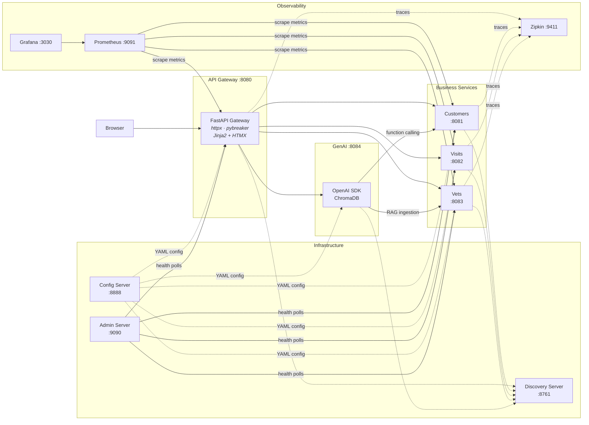

# Architecture Diagrams — Python/FastAPI Petclinic Microservices

> These diagrams reflect the **Python/FastAPI** rewrite, not the original Java/Spring Boot project.
> All services are built with FastAPI + Uvicorn. There is no Spring, no Eureka, no Spring Cloud.

---

## Detailed Architecture Diagram

```mermaid
graph TB
    %% ── Styling ──────────────────────────────────────────────
    classDef infra fill:#e8f5e9,stroke:#2e7d32,stroke-width:2px,color:#1b5e20
    classDef gateway fill:#e3f2fd,stroke:#1565c0,stroke-width:2px,color:#0d47a1
    classDef business fill:#fff3e0,stroke:#e65100,stroke-width:2px,color:#bf360c
    classDef genai fill:#f3e5f5,stroke:#7b1fa2,stroke-width:2px,color:#4a148c
    classDef observability fill:#fce4ec,stroke:#c62828,stroke-width:2px,color:#b71c1c
    classDef external fill:#f5f5f5,stroke:#616161,stroke-width:1px,color:#424242
    classDef db fill:#e0f2f1,stroke:#00695c,stroke-width:1px,color:#004d40

    %% ── Browser ──────────────────────────────────────────────
    Browser["Browser<br/><i>HTMX + Jinja2 UI</i>"]

    %% ── Infrastructure Services ──────────────────────────────
    subgraph infra_layer ["Infrastructure Services (FastAPI)"]
        ConfigServer["Config Server :8888<br/><b>FastAPI + PyYAML</b><br/>Reads local config/ dir"]:::infra
        DiscoveryServer["Discovery Server :8761<br/><b>FastAPI + in-memory registry</b><br/>POST /register · GET /services"]:::infra
        AdminServer["Admin Server :9090<br/><b>FastAPI + httpx</b><br/>Health monitoring dashboard"]:::infra
        ConfigDir[("config/<br/>YAML files")]:::db
    end

    %% ── API Gateway ──────────────────────────────────────────
    subgraph gw_layer ["API Gateway :8080 (FastAPI)"]
        Gateway["API Gateway<br/><b>FastAPI + Uvicorn</b>"]:::gateway
        GWProxy["Reverse Proxy<br/><i>httpx · StripPrefix=2</i>"]:::gateway
        GWCB["Circuit Breaker<br/><i>pybreaker + tenacity</i>"]:::gateway
        GWBFF["BFF Aggregation<br/><i>/api/gateway/owners/id</i>"]:::gateway
        GWPages["Server-Side UI<br/><i>Jinja2 + HTMX</i>"]:::gateway
    end

    %% ── Business Services ────────────────────────────────────
    subgraph biz_layer ["Business Services (FastAPI + SQLAlchemy async)"]
        Customers["Customers Service :8081<br/><b>FastAPI + Pydantic</b><br/>SQLAlchemy async<br/>SQLite / PostgreSQL"]:::business
        Visits["Visits Service :8082<br/><b>FastAPI + Pydantic</b><br/>SQLAlchemy async<br/>SQLite / PostgreSQL"]:::business
        Vets["Vets Service :8083<br/><b>FastAPI + Pydantic</b><br/>SQLAlchemy async<br/>SQLite / PostgreSQL"]:::business
    end

    %% ── GenAI Service ────────────────────────────────────────
    subgraph ai_layer ["GenAI Service :8084 (FastAPI)"]
        GenAI["GenAI Service<br/><b>FastAPI + OpenAI Python SDK</b><br/>gpt-4o-mini · tool calling"]:::genai
        ChromaDB["ChromaDB<br/><i>Ephemeral vector store</i><br/>Vet data for RAG"]:::genai
    end

    %% ── Observability Stack ──────────────────────────────────
    subgraph obs_layer ["Observability"]
        Zipkin["Zipkin :9411<br/><i>Distributed tracing</i>"]:::observability
        Prometheus["Prometheus :9091<br/><i>Metrics scraping</i>"]:::observability
        Grafana["Grafana :3030<br/><i>Dashboards</i>"]:::observability
    end

    %% ── External ─────────────────────────────────────────────
    OpenAIAPI["OpenAI API<br/><i>gpt-4o-mini</i>"]:::external

    %% ── Browser → Gateway ────────────────────────────────────
    Browser -->|"HTTP requests"| Gateway

    %% ── Gateway internals ────────────────────────────────────
    Gateway --- GWProxy
    Gateway --- GWBFF
    Gateway --- GWPages
    GWProxy --- GWCB

    %% ── Gateway → Business Services ──────────────────────────
    GWProxy -->|"/api/customer/** → :8081"| Customers
    GWProxy -->|"/api/visit/** → :8082"| Visits
    GWProxy -->|"/api/vet/** → :8083"| Vets
    GWProxy -->|"/api/genai/** → :8084"| GenAI

    %% ── BFF aggregation ──────────────────────────────────────
    GWBFF -->|"httpx GET /owners/id"| Customers
    GWBFF -->|"httpx GET /pets/visits"| Visits

    %% ── GenAI → backends ─────────────────────────────────────
    GenAI -->|"Function calling<br/>httpx → /owners, /owners/id/pets"| Customers
    GenAI -->|"Vet data ingestion<br/>httpx → /vets"| Vets
    GenAI -->|"Chat completions"| OpenAIAPI
    GenAI --- ChromaDB

    %% ── Config Server reads YAML ─────────────────────────────
    ConfigDir -->|"PyYAML"| ConfigServer

    %% ── All services fetch config on startup ─────────────────
    ConfigServer -.->|"GET /config/service-name"| DiscoveryServer
    ConfigServer -.->|"GET /config/service-name"| Gateway
    ConfigServer -.->|"GET /config/service-name"| Customers
    ConfigServer -.->|"GET /config/service-name"| Visits
    ConfigServer -.->|"GET /config/service-name"| Vets
    ConfigServer -.->|"GET /config/service-name"| GenAI
    ConfigServer -.->|"GET /config/service-name"| AdminServer

    %% ── All services register with Discovery Server ──────────
    Gateway -.->|"POST /register"| DiscoveryServer
    Customers -.->|"POST /register"| DiscoveryServer
    Visits -.->|"POST /register"| DiscoveryServer
    Vets -.->|"POST /register"| DiscoveryServer
    GenAI -.->|"POST /register"| DiscoveryServer
    AdminServer -.->|"POST /register"| DiscoveryServer

    %% ── Admin polls health ───────────────────────────────────
    AdminServer -->|"httpx GET /actuator/health"| Customers
    AdminServer -->|"httpx GET /actuator/health"| Visits
    AdminServer -->|"httpx GET /actuator/health"| Vets
    AdminServer -->|"httpx GET /actuator/health"| GenAI
    AdminServer -->|"httpx GET /actuator/health"| Gateway

    %% ── Observability: tracing ───────────────────────────────
    Gateway -.->|"OpenTelemetry<br/>B3 propagation"| Zipkin
    Customers -.->|"OpenTelemetry spans"| Zipkin
    Visits -.->|"OpenTelemetry spans"| Zipkin
    Vets -.->|"OpenTelemetry spans"| Zipkin
    GenAI -.->|"OpenTelemetry spans"| Zipkin

    %% ── Observability: metrics ───────────────────────────────
    Prometheus -->|"Scrape /actuator/prometheus<br/>prometheus-fastapi-instrumentator"| Gateway
    Prometheus -->|"Scrape /actuator/prometheus"| Customers
    Prometheus -->|"Scrape /actuator/prometheus"| Visits
    Prometheus -->|"Scrape /actuator/prometheus"| Vets
    Grafana -->|"PromQL queries"| Prometheus
```

### Legend

| Line style | Meaning |
|---|---|
| **Solid arrow** `-->` | Runtime HTTP request (data plane) |
| **Dashed arrow** `-.->` | Infrastructure / control plane (config fetch, service registration, trace export) |
| **Solid line** `---` | Internal composition (subcomponents of the same service) |

### Technology Stack Summary

| Layer | Technology | Replaces (Java) |
|---|---|---|
| Web framework | **FastAPI** + Uvicorn | Spring Boot |
| Data models | **Pydantic** v2 | Jakarta Bean Validation |
| ORM / DB | **SQLAlchemy** async + aiosqlite/asyncpg | Spring Data JPA + Hibernate |
| HTTP client | **httpx** (async) | WebClient / RestClient |
| Circuit breaker | **pybreaker** + **tenacity** (retry) | Resilience4j |
| Config server | **FastAPI** + **PyYAML** (local YAML files) | Spring Cloud Config (Git) |
| Service discovery | **FastAPI** in-memory registry | Netflix Eureka |
| UI rendering | **Jinja2** templates + **HTMX** | AngularJS SPA |
| GenAI | **OpenAI Python SDK** + **ChromaDB** | Spring AI + SimpleVectorStore |
| Tracing | **OpenTelemetry** + Zipkin exporter + **B3** propagation | Micrometer Tracing + Brave |
| Metrics | **prometheus-fastapi-instrumentator** + prometheus_client | Micrometer + Prometheus Registry |
| Logging | **Loguru** | SLF4J + Logback |
| Build / deps | **Poetry** (pyproject.toml) | Maven (pom.xml) |

---

## Service Topology (simplified)

This is a high-level view suitable for embedding in a README.

### Port Map

| Service | Port | Role |
|---|---|---|
| Config Server | 8888 | Centralized YAML configuration |
| Discovery Server | 8761 | In-memory service registry |
| API Gateway | 8080 | Reverse proxy, BFF, HTMX UI |
| Customers Service | 8081 | Owner and pet CRUD |
| Visits Service | 8082 | Visit CRUD |
| Vets Service | 8083 | Vet listing |
| GenAI Service | 8084 | AI chatbot (OpenAI + ChromaDB) |
| Admin Server | 9090 | Health monitoring dashboard |
| Zipkin | 9411 | Distributed trace collector |
| Prometheus | 9091 | Metrics scraping and storage |
| Grafana | 3030 | Metrics dashboards |
